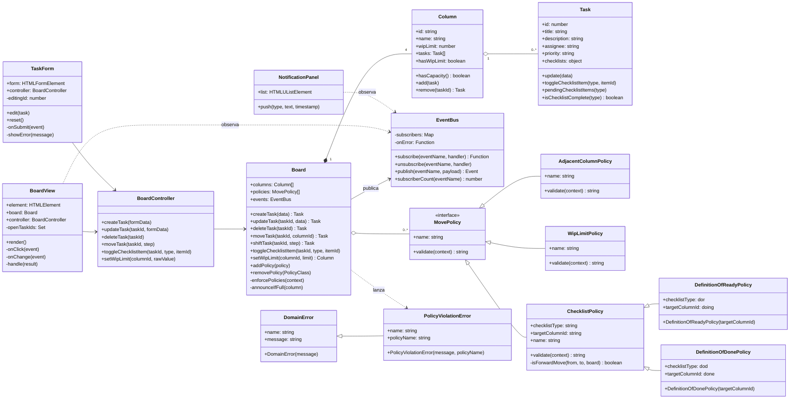

# Diagrama de clases

```mermaid
classDiagram
    direction LR

    class Board {
        +columns: Column[]
        +policies: MovePolicy[]
        +events: EventBus
        +createTask(data) Task
        +updateTask(taskId, data) Task
        +deleteTask(taskId) Task
        +moveTask(taskId, columnId) Task
        +shiftTask(taskId, step) Task
        +toggleChecklistItem(taskId, type, itemId)
        +setWipLimit(columnId, limit) Column
        +addPolicy(policy)
        +removePolicy(PolicyClass)
        -enforcePolicies(context)
        -announceIfFull(column)
    }

    class Column {
        +id: string
        +name: string
        +wipLimit: number
        +tasks: Task[]
        +hasWipLimit: boolean
        +hasCapacity() boolean
        +add(task)
        +remove(taskId) Task
    }

    class Task {
        +id: number
        +title: string
        +description: string
        +assignee: string
        +priority: string
        +checklists: object
        +update(data)
        +toggleChecklistItem(type, itemId)
        +pendingChecklistItems(type)
        +isChecklistComplete(type) boolean
    }

    class EventBus {
        -subscribers: Map
        -onError: Function
        +subscribe(eventName, handler) Function
        +unsubscribe(eventName, handler)
        +publish(eventName, payload) Event
        +subscriberCount(eventName) number
    }

    class MovePolicy {
        <<interface>>
        +name: string
        +validate(context) string
    }
    class AdjacentColumnPolicy {
        +name: string
        +validate(context) string
    }
    class WipLimitPolicy {
        +name: string
        +validate(context) string
    }
    class ChecklistPolicy {
        +checklistType: string
        +targetColumnId: string
        +name: string
        +validate(context) string
        -isForwardMove(from, to, board) boolean
    }
    class DefinitionOfReadyPolicy {
        +checklistType: dor
        +targetColumnId: doing
        +DefinitionOfReadyPolicy(targetColumnId)
    }
    class DefinitionOfDonePolicy {
        +checklistType: dod
        +targetColumnId: done
        +DefinitionOfDonePolicy(targetColumnId)
    }

    class BoardController {
        +createTask(formData)
        +updateTask(taskId, formData)
        +deleteTask(taskId)
        +moveTask(taskId, step)
        +toggleChecklistItem(taskId, type, itemId)
        +setWipLimit(columnId, rawValue)
    }

    class BoardView {
        +element: HTMLElement
        +board: Board
        +controller: BoardController
        -openTaskIds: Set
        +render()
        -onClick(event)
        -onChange(event)
        -handle(result)
    }
    class TaskForm {
        +form: HTMLFormElement
        +controller: BoardController
        -editingId: number
        +edit(task)
        +reset()
        -onSubmit(event)
        -showError(message)
    }
    class NotificationPanel {
        +list: HTMLUListElement
        +push(type, text, timestamp)
    }

    class DomainError {
        +name: string
        +message: string
        +DomainError(message)
    }
    class PolicyViolationError {
        +name: string
        +policyName: string
        +PolicyViolationError(message, policyName)
    }

    Board "1" *-- "4" Column
    Column "1" o-- "0..*" Task
    Board o-- "0..*" MovePolicy
    Board --> EventBus : publica
    MovePolicy <|-- AdjacentColumnPolicy
    MovePolicy <|-- WipLimitPolicy
    MovePolicy <|-- ChecklistPolicy
    ChecklistPolicy <|-- DefinitionOfReadyPolicy
    ChecklistPolicy <|-- DefinitionOfDonePolicy
    BoardController --> Board
    BoardView --> BoardController
    TaskForm --> BoardController
    BoardView ..> EventBus : observa
    NotificationPanel ..> EventBus : observa
    DomainError <|-- PolicyViolationError
    Board ..> PolicyViolationError : lanza
```
